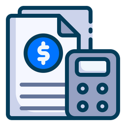

# Track Your Spendings

    

## Introduction

- This is an application where users can record and manage their financial budgets.
- The application is tailored to simplify the often complex process of categorizing transactions and analyzing expenses, making personal finance management accessible to all users.

[//]: # "## Table of Contents"
[//]: # "- Provide a table of contents if the README is lengthy."

---

## Installation

### Prerequisites

- Ensure [.NET SDK/Runtime](https://dotnet.microsoft.com/download) (version 8.0 is installed on your machine).
- Ensure you have `postgres` installed on your machine or you can connect to remote db.
- Install [Visual Studio](https://visualstudio.microsoft.com/) or your favorite editor/IDE.

### Getting the Project

- Clone the repository: `git clone https://github.com/kimfom01/TrackYourSpendings.git`
- Alternatively, download and extract the project ZIP file.

### Configuration

[//]: # "- Set necessary environment variables in `.env` file or system environment."

- Update `appsettings.json` with your typical [postgresql connection string](https://www.connectionstrings.com/postgresql/).

### Building the Project

- Navigate to the project's root directory in the terminal.
- Run `dotnet build` to compile the project.

[//]: # "### Database Setup (If Applicable)"
[//]: # "- Run `dotnet ef database update` to apply migrations."

### Running the Application

- Navigate to the project root directory
- Restore dependencies `dotnet restore`
- Execute `dotnet run` (or `dotnet run -lp Kestrel` for https) within the project directory.
- Open `http://localhost:5162` or (`https://localhost:7001` for https) on the web browser to access the application.

### Publishing (For Deployment)

- Run `dotnet publish -c Release -o ./publish` to package the application for deployment.
- Deploy the contents of the `./publish` directory to your hosting environment.

---

## Features

- Ability to manage multiple wallets
- Search transactions record history by name, category and date
- Group and filter transactions by categories and date
- Record transactions
- Sign in and register with google account
- Reports, charts (upcoming feature)

---

## Roadmap

- Reports page with bar chart to show total spendings across months within a year
- Pie chart on report page to show percentage of spendings per category

## Hosting

- [Render](https://render.com/) (docker image)

## Database Provider

- Postgres through [neon.tech](https://neon.tech/)

## Authors

Contributors names and contact info

- Kim Fom - [kimfom01@gmail.com](mailto:kimfom01@gmail.com)

[//]: # "## Contributing"
[//]: # "- Guidelines for those who want to contribute to the project."
[//]: # "- Mention how they can submit pull requests and propose bug fixes or new features."
[//]: # "## Code of Conduct"
[//]: # "- Outline expectations for participation and the process for reporting unacceptable behavior."
[//]: # "## License"
[//]: # "- Specify the license under which the project is released."
[//]: # "## Credits"
[//]: # "- Acknowledge contributors and any third-party resources or libraries used."
[//]: #
[//]: # "## Contact Information"
[//]: # "- Provide contact details for further queries or discussions."
[//]: #
[//]: # "## Changelog"
[//]: # "- (Optional) Include a changelog file detailing the chronological changes made to the project."
[//]: #
[//]: # "## FAQs"
[//]: # "- (Optional) Frequently asked questions about the project."
[//]: #
[//]: # "## Screenshots/Demo"
[//]: # "- (Optional) Include screenshots or a demo video to visually demonstrate your project."
[//]: #
[//]: # "## Known Issues and Roadmap"
[//]: # "- (Optional) List any known issues and future plans for the project."
